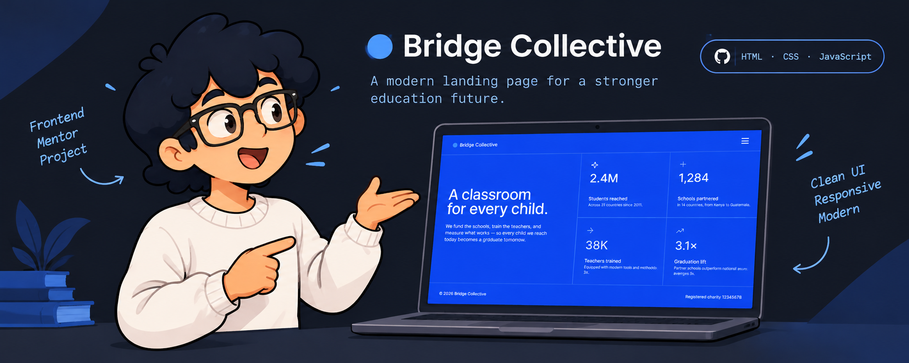

# 📘 Bridge Collective — Grid landing page



> Una landing page responsive para una organización ficticia que impulsa la educación, creada como solución al desafío **Grid landing page** de [Frontend Mentor](https://www.frontendmentor.io/challenges/grid-landing-page).

[Ver demo en vivo](https://mirodev20.github.io/grid-landing-page/) · [Ver el desafío](https://www.frontendmentor.io/challenges/grid-landing-page) · [Ver el repositorio](https://github.com/MiroDev20/grid-landing-page)

## 📜 Índice

- [Propósito](#propósito)
- [Características](#características)
- [Tecnologías y decisiones](#tecnologías-y-decisiones)
- [Cómo ejecutarlo](#cómo-ejecutarlo)
- [Estructura](#estructura)
- [Aprendizajes](#aprendizajes)
- [Comprobaciones realizadas](#comprobaciones-realizadas)
- [Créditos](#créditos)

## ⚜️ Propósito

El objetivo fue transformar los diseños de referencia en una interfaz de una sola página que comunicara el impacto de Bridge Collective: su misión educativa y cuatro estadísticas principales. El reto pone el foco en que la composición siga siendo clara tanto en móvil como en pantallas amplias, donde la presentación y la cuadrícula de estadísticas cambian de disposición.

Este proyecto sirve también como registro práctico de mi aprendizaje con HTML semántico, CSS Grid, diseño responsive y pequeñas interacciones con JavaScript.

## ✨ Características

- Diseño responsive inspirado en las referencias móvil y escritorio del desafío.
- Cabecera con marca y menú de navegación desplegable.
- Panel de navegación con overlay al abrirse y botón que alterna entre los iconos de menú y cierre.
- Cuadrícula de estadísticas sobre el alcance de la organización ficticia.
- Estados visuales al pasar el cursor por enlaces y tarjetas.
- Estructura semántica con `header`, `nav`, `main`, `section`, lista de definiciones (`dl`) y `footer`.
- Metadatos de descripción y Open Graph para una mejor vista previa al compartir el sitio.

## ⚙️ Tecnologías y decisiones

| Área | Elección | Motivo |
| --- | --- | --- |
| Estructura | HTML5 semántico | Da contexto al contenido y facilita su recorrido con tecnologías de asistencia. |
| Estilos | CSS, variables personalizadas, Flexbox y CSS Grid | Permite organizar el hero y adaptar la cuadrícula a cada tamaño de pantalla sin dependencias. |
| Interacción | JavaScript nativo con módulos ES | Mantiene pequeña la lógica del menú y evita añadir una librería para una única interacción. |
| Organización | Componentes de marcado y estilos separados por área | Header, contenido principal, footer, navegación y overlay se pueden localizar y revisar con facilidad. |
| Tipografía | Inter Variable, incluida localmente | Evita depender de una carga externa y conserva el aspecto definido por el reto. |

Una decisión de accesibilidad importante fue usar una lista de definiciones para las estadísticas: el concepto se encuentra antes de su cifra en el HTML, aunque CSS los coloque visualmente según el diseño. Los iconos decorativos usan texto alternativo vacío para que no añadan ruido a un lector de pantalla.

## 🚀 Cómo ejecutarlo

No requiere instalar paquetes ni compilar nada. Clona o descarga el repositorio y ábrelo desde un servidor local estático; esto es necesario porque el JavaScript se carga como módulo. Por ejemplo, si tienes Visual Studio Code, puedes usar la extensión **Live Server** sobre `index.html`.

Después visita la dirección local que indique el servidor y prueba el menú en anchos de móvil y escritorio.

## 📁 Estructura

```text
.
├── assets/                 # Fuente local, iconos e imágenes
├── design/                 # Referencias visuales entregadas por el desafío
├── src/
│   ├── logic/              # Componentes de marcado y lógica del menú
│   └── styles/             # Estilos globales y estilos por área de interfaz
├── index.html              # Documento base, metadatos y puntos de entrada
├── journal.md              # Bitácora de decisiones y aprendizajes
├── style-guide.md          # Colores, tipografía y tamaños de referencia
└── preview.jpg             # Captura de la solución
```

## 📝 Aprendizajes

Durante el desarrollo documenté el proceso en [`journal.md`](./journal.md). Los aprendizajes que más marcaron el resultado fueron:

- Elegir elementos HTML por su significado, no solo por su apariencia.
- Aplicar la convención BEM para que los estados, como el menú abierto, sean explícitos.
- Entender que un elemento solo participa en la cuadrícula de su contenedor directo; revisar la jerarquía fue clave para colocar la navegación en escritorio.
- Usar `grid-template-areas` para expresar la composición de la interfaz y CSS Grid para las cuatro estadísticas.
- Detectar que un overlay con desplazamiento y altura total puede provocar desbordamiento vertical, aunque esté posicionado de forma absoluta.
- Separar CSS por responsabilidades sin fragmentar innecesariamente una landing pequeña.

## 🧪 Comprobaciones realizadas

- Comparación visual con las referencias de móvil y escritorio incluidas en `design/`.
- Revisión del comportamiento del menú abierto y cerrado, incluido el overlay.
- Verificación manual de los estados hover de enlaces y tarjetas.
- Revisión de la distribución en anchos pequeños y grandes, además de los tamaños de referencia de 375 px y 1440 px.

## 👥 Créditos

- Desafío y diseño: [Frontend Mentor](https://www.frontendmentor.io/).
- Tipografía: [Inter](https://fonts.google.com/specimen/Inter).
- Implementación y documentación: [MiroDev20](https://github.com/MiroDev20).

---

Si encuentras una mejora visual, de accesibilidad o de documentación, abre un issue o compártela en la [comunidad de Frontend Mentor](https://www.frontendmentor.io/community).
