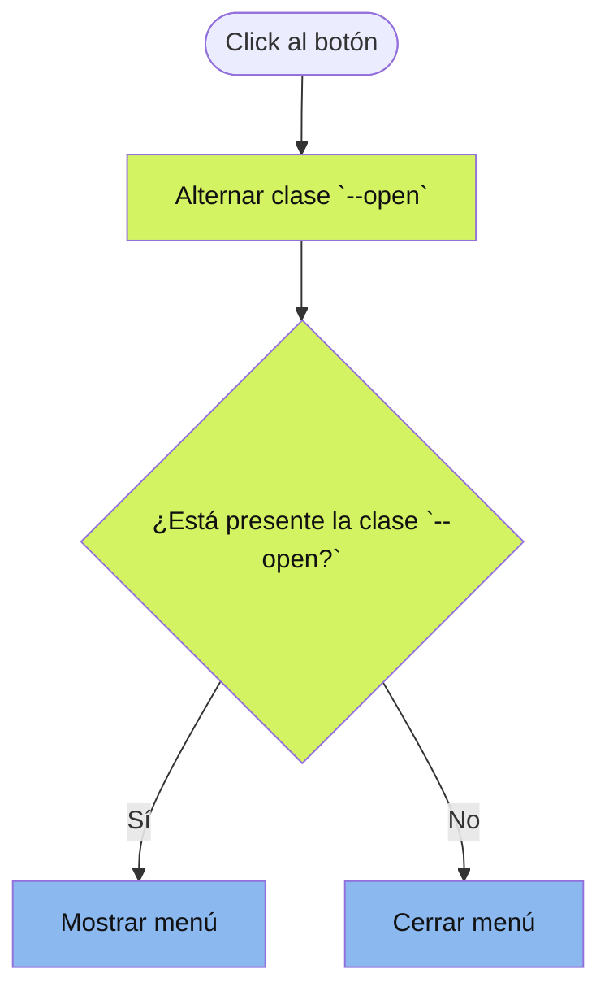

# 📔 Diario de desarrollo

En este diario documentaré mi proceso de desarrollo del proyecto *Grid Landing
Page Main*. Registraré los avances, decisiones, dificultades y aprendizajes que
surjan durante la construcción de la página, con el objetivo de seguir mi
progreso y mejorar mis habilidades en HTML y CSS.

## 📅 23 de septiembre de 2026 — Exploración inicial de la documentación

### 🎯 Objetivo

Explorar el proyecto y ubicarme en el punto de partida.

### 🎧 Lo que escuché

<table>
    <td>
        
        

            

                
                oiabreeze
            

            
<i>Grooves de otoño que sientan tan bien 🍂🎧 | Cozy Chill Pop · Jazzhop & Lofi · Café · Focus · BGM </i>

            <ul>
               <li>
                    <a href="https://www.youtube.com/@oiabreeze/featured">
                        
                        YouTube
                    </a>
                </li>
               <li>
                    <a href="https://open.spotify.com/intl-es/artist/7MDZDPiL6AGmcZvgqqOFxd">
                        
                        Spotify
                    </a>
                </li>
            </ul>
        

    </td>
</table>

### 🛠️ Trabajo realizado

- Leer la documentación actual del proyecto.
- Pasearme por `index.html` para averiguar qué tocar primero.
- Darle mi formato al código HTML en la sección `head`.
- Identificar elementos del navbar.
- Dar estructura al contenido de la hero section.

### 🧠 Lo que aprendí

- Si uso `/` como valor de un `href`, me redirige a la página de inicio.
- Aunque no tengan texto alternativo, conviene mantener `alt=""` en las
  imágenes para que los lectores de pantalla las ignoren, ya que son
  decorativas.

#### 📋 Lista de definiciones

- `<dl>`: *definition list* → lista de definiciones.
- `<dt>`: *definition term* → término de definición.
- `<dd>`: *definition description* → descripción de término.

### ✅ Resultado

- Quedó estructurada la cabecera con la identidad de la marca y el botón
    del menú. La interacción del navbar queda pendiente para una próxima etapa.
- Hero section estructurada semánticamente.

### 🚧 Dificultades

Invertí el orden de los dos primeros elementos de cada grupo estadístico, de
manera que los conceptos quedan antes que su valor. Así mejoro la legibilidad
para los lectores de pantalla y las personas que navegan con teclado.

El problema es que, en el diseño de referencia, primero aparece el valor y
después el concepto. Sé que se puede solucionar con CSS, pero todavía no sé cómo.

### 👣 Próximos pasos

- ~~Dar estructura HTML al contenido de la sección hero.~~
- ~~Dar estructura al contenido del footer.~~

## 📅 24 de septiembre de 2026 — Estructuración final de la página

### 🎯 Objetivo

Hoy terminaré la estructura semántica de la página web. Concretamente:

- footer
- navbar

y posteriormente agregar los `aria-labels` y clases con *BEM* a todo.

También quiero añadir el metadato *description* al head y algunos otros para
Open Graph.

### 🎧 Lo que escuché

<table>
    <td>
        
        

            

                
                oiabreeze
            

            
<i>Grooves de otoño que sientan tan bien 🍂🎧 | Cozy Chill Pop · Jazzhop & Lofi · Café · Focus · BGM </i>

            <ul>
               <li>
                    <a href="https://www.youtube.com/@oiabreeze/featured">
                        
                        YouTube
                    </a>
                </li>
               <li>
                    <a href="https://open.spotify.com/intl-es/artist/7MDZDPiL6AGmcZvgqqOFxd">
                        
                        Spotify
                    </a>
                </li>
            </ul>
        

    </td>
</table>

### 🛠️ Trabajo realizado

- Estructuración de footer y navbar.
- Adición de clases con convención *BEM*.
- Añadí metadatos Open Graph para controlar la vista previa al compartir la
    página en redes sociales.

### 🧠 Lo que aprendí

El modificador en BEM se añade para representar un estado diferente al predeterminado.
No es necesario crear una clase para el estado original, porque se asume que ese
estado es el que no tiene modificador.

---

He aprendido a usar *Open Graph* 😁, lo creí difícil, pero solo consiste en aprender
sus metadatos y que representa cada uno.

---

Había escrito que le añadiría `aria-labels` a todo, pero eso solo confundiría a
los lectores de pantalla pues hay elementos que por sí solos se describen bien,
como por ejemplo los elementos de mi navbar:

- About
- Our Work
- Partners
- Annual Report
- Donate

Así que añadirles `aria-labels` sobra.

Lo misma pasa con el contenido de mi hero section.

### ✅ Resultado

- Página estructurada con elementos semánticos como `header`, `main`, `section`,
    `nav` y `footer`.
- Navbar organizada con una lista de enlaces clara y comprensible para lectores
    de pantalla.
- Clases añadidas siguiendo la convención *BEM*.
- Metadatos Open Graph añadidos para controlar la vista previa de la página al
    compartirla en redes sociales.
- Atributos ARIA añadidos únicamente donde aportan información adicional.

### 👣 Próximos pasos

- ~~Crear la interacción del menú hamburguesa con JavaScript.~~
- Comenzar a escribir los estilos CSS siguiendo las clases creadas con *BEM*.

## 📅 28 de septiembre de 2026 — Optimización de la lógica y maquetación con CSS Grid

### 🎯 Objetivo

- Revisar la lógica y explicarla.
- Organizar las partes de la página con CSS Grid, siguiendo el diseño de referencia.
- Comprobar que la distribución se adapte correctamente a distintos tamaños de pantalla.

### 🎧 Lo que escuché

<table>
    <td>
        
        

            

                
                Oldies Station
            

            

                <i>
                    1940's calm night in the autumn with 
                    relaxing vintage oldies playing in 
                    another room (cricket asmr)
                </i>
            

            <ul>
               <li>
                    <a href="1940's calm night in the autumn with relaxing vintage oldies playing in another room (cricket asmr)">
                        
                        YouTube
                    </a>
                </li>
            </ul>
        

    </td>
</table>

### 🛠️ Trabajo realizado

- Implementación de la interacción del menú: alternancia de la clase del botón y
    actualización de aria-expanded. El CSS muestra u oculta la navegación y los iconos.

### 🧠 Lo que aprendí

- Aprendí que JavaScript puede añadir o quitar clases de un elemento con `classList.toggle()`.
    Después, CSS aplica los estilos correspondientes a cada estado.
- También aprendí que `aria-expanded` comunica si la navegación está abierta o cerrada.

#### Flujo de la lógica

- 🟡 Responsabilidad de JavaScript
- 🔵 Responsabilidad de CSS

